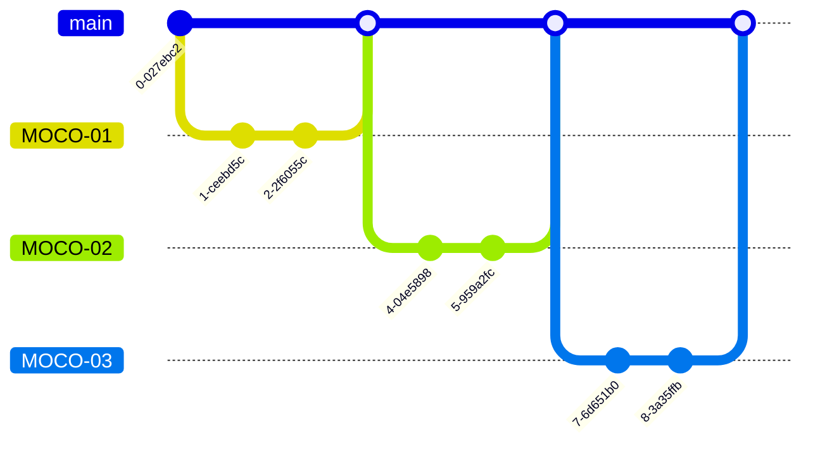

# MOCO v2

> study, project, mentoring platform

# index

- [outline](#outline)
- [gitflow](#gitflow)
- [architecture](#architecture)

# outline

Study, project, and mentoring platform used by programmers, planners, and designers

  

# Gitflow

> Describes JIRA-based gitflow

1. Create a JIRA ticket before you start working.

2. One ticket should preferably be a single commit.

3. Keep the commit graph as simple as possible.

4. Don't change the revision history of branches you share with each other.

5. Make sure to get reviews from reviewers.
6. merge your own pull requests.

 

# Architecture

